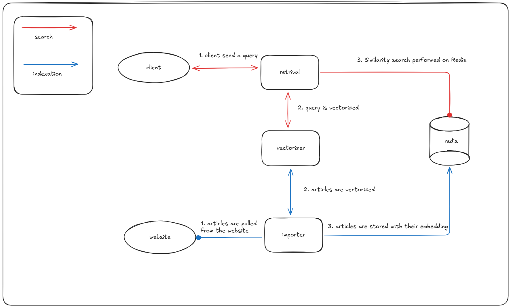

# GS Search - Semantic Search Engine

This project implements a small POC semantic search engine for French news sites (vsd.fr and public.fr). It includes the storage, the import logic, and the retrieval.

## Quick start

### Prerequisites

- Docker Engine (v29)
- Docker Compose (v5)

### Running with Docker Compose

You can bootstrap all services using:

```bash
make
```

and observe the logs:

```bash
make logs
```

Stop all the services:

```bash
make down
```

Clean the data (remove the volume with imported articles)

```bash
make clean
```

Run unit-tests using:

```bash
make test
```

### Search API

Search for articles:

```bash
curl -X POST http://localhost:8080/search \
  -H "Content-Type: application/json" \
  -d '{"query": "something very smart"}'
```

The ten most relevant results are returned in the result set.
Optionnally, pipe the result in `jq` to obtain a formated output.

*TODO*:

- configurable size for the result set.
- pagination mechanism for less relevant results?

### Import articles

Articles are imported and searchable over time.
The actual time taken to import all articles from both websites depends
on the resources (CPU mainly) available.

## Architecture



Different microservices compose the search engine:

### Vectorizer service(s)

The vectorizer service only role is to take texts as input and generate embeddings from it.
A small API is exposed through FastAPI (Python) to receive batch of strings for transformation.

```json
POST /embed
{"texts" : []string }
```

To vectorize text, the service rely on the SentenceTransformers python library to load and use a model.
The model may be set using the MODEL_NAME env variable, and is defaulted to "paraphrase-MiniLM-L3-v2".
The EMBEDDING_DIMENSION must also be set to match the dimension of the vectors generated by the model.

#### Alternatives considered

**Use a model better suited for french**:
Other models are more suited for french, or multilanguages. However, the default one is very fast and uses very few memory, which is a good fit for a local setup.

**Enable multiple workers in FastAPI**:
By default FastAPI only has a single worker, and each request is handled sequentially. Enabling multiple workers, and loading the model in memory for each, would increase resources usage but could enable more throughput.
Ultimately, the resources are already maxed out for a single machine (of reasonable size). In a real world scenario, it is better to scale-out the vectorizers and load balance the vectorization requests between the different vectorizer to make usage of multiple machines.

**Replace Python with Rust**:
*TODO*: Rust is also often used to load and use models. I could test to use Rust in order to have a more efficient handling of concurrent requests and resources.
Python probably requires more memory and time to start the service. However, Python is good to quickly bootstrap such service.
In order to finalize the project in a few hours, I went for python without testing my assumptions.

### Redis instance

Used as the storage for articles with their embeddings, Redis is spawned with the instance with some default parameters.
As it loads everything in memory, the search is blasing fast.
The vectors are stored in an flat index, to enable exhaustive search.
A dashboard to monitor redis is exposed to the host on port 21042 by default.

#### Alternatives considered

**Create a HNSW index**:
HNSW indices are the trendy way to index vectors and it is known to enable fast search at the cost of a bit more memory.
However, given the low number of vectors here, the speed of the exhaustive search is good enough.

**Use PgSQL with pgvector**:
I could also have easily spawned a postgres instance with pgvector to store the embeddings.
A small instance would have been equally simple to bootstrap and configure.
However I wanted to test the capabilities of Redis in this project as I was more curious about this one.

### Retrieval service(s)

The retrieval service exposes the search API to the end user.

```json
POST /search
{"query" : string }
```

Received queries are forwarded to vectorizers to generates an embedding. This is then used by the retrieval service
to perform a KNN search on the Redis instance, and returns each article title with an url, and its computed score.
The score is a number from 0 to 1, lower means higher similarity.

### Importer service(s)

The importer service is responsible to fetch the articles from a website. Each service is dedicated to its website.
The service starts with an initial import process:

- fetch all the articles of the website
- vectorize articles in batch
- store articles on Redis

After the initial import, the service regularly pulls the newest articles from the websites:
This ensures the data in Redis is kept up to date.

To pull articles from the website, the importer call the Wordpress REST Api to list articles, page by page, with a 100 articles per page.
Each article title and description are concatenated before vectorization.

#### Alternatives considered

**Use sitemaps for initial import**:
The sitemaps could have been used instead of the Wordpress API to get all the articles. This would have ensured better compatibility.
However, this approach proved to be more complicated to implement while the Wordpress API is extermely easy to use.

**Use RSS feed**:
The RSS feed is also an alternative, simple to implement. While its suited for the periodic pulling of the news,
it is not usable for initial imports.

**Post processing of the data**:
*TODO*: The data is not always correctly formated, and relevance could be improved by processing the data before vectorization.

**Vectorize the content of articles**:
The importer are only vectorizing article descriptions. Better relevance could be achieved by vectorizing the whole article instead.
However, the size of an article could reach the max context length of the model, which would have required "chunking" to go around.
Obviously, I did not have the time to implement such workaround for this project.

**Intermediate articles cache**:
It could make sense to pull the article data and write it in a file locally, as an intermediate cache and avoid performing calls on
the website in case the initial import is restarted.
As, in the context of this project, the importer services are not expected to be restarted in loop, I didn't find it necessary to
add this optimization.

**Avoid duplicates**:
*TODO*: Before vectorizing articles, it could have been better to check if the article is already in Redis to avoid re-vectorizing an article that would already be in storage.
As the initial import is not supposed to be started multiple times, only the periodic pull of the newest articles are often duplicated.
Given the low impact of the duplication, I did not spend time to implement this optimisation.

## Development

### Prerequisites

- Go v1.21+
- Python v3.11+

### Project Structure

```bash
.
├── services/
│   ├── importer/
│   │   ├── Dockerfile       # Importer container build
│   │   ├── cmd/             # Entry point (main.go)
│   │   └── internal/        # Business logic
│   ├── retrieval/
│   │   ├── Dockerfile       # Retrieval container build
│   │   ├── cmd/             # Entry point (main.go)
│   │   └── internal/        # Server implementation
│   └── vectorizer/          # Python/FastAPI service
│       ├── Dockerfile       # Vectorizer container build
│       ├── server.py
│       └── requirements.txt
├── pkg/
│   ├── store/               # Go Redis client for vector search
│   └── vectorization/       # Go client to communicate with the vectorizer
├── docker-compose.yml       # Service orchestration
└── Makefile
```

Model configuration is centralized in `docker-compose.yml` using YAML anchors:

```yaml
x-model-config: &model-config
  MODEL_NAME: paraphrase-MiniLM-L3-v2
  EMBEDDING_DIMENSION: "384"
```

### Environment Variables

All services are configured via environment variables. The model configuration is centralized in `build/docker-compose.yml` using YAML anchors to ensure consistency.

#### Global Configuration

These variables must be consistent across all services:

| Variable | Description | Default | Used By |
| -------- | ----------- | ------- | ------- |
| `MODEL_NAME` | SentenceTransformer model identifier | `paraphrase-MiniLM-L3-v2` | Vectorizer |
| `EMBEDDING_DIMENSION` | Vector dimension (must match model output) | `384` | Importer, Retrieval |

#### Vectorizer Service

| Variable | Description | Default |
| -------- | ----------- | ------- |
| `PORT` | HTTP server port | `8080` |
| `HOST` | Server bind address | `0.0.0.0` |
| `LOG_LEVEL` | Logging level (DEBUG, INFO, WARN, ERROR) | `WARN` |

#### Importer Service

| Variable | Description | Default |
| -------- | ----------- | ------- |
| `REDIS_ADDR` | Redis server address | (required) |
| `REDIS_PASSWORD` | Redis password | `""` (empty) |
| `VECTORIZER_ADDR` | Vectorizer service base URL | (required) |
| `TARGET_URL` | Website URL to import from | (required) |
| `POLL_INTERVAL` | Time between polling cycles | `10s` |
| `DEBUG_MODE` | Enable debug logging | `false` |
| `EMBEDDING_DIMENSION` | Vector dimension | `384` |
| `IMPORT_MAX_GOROUTINES` | Concurrent goroutines for initial import | `1` |

#### Retrieval Service

| Variable | Description | Default |
| -------- | ----------- | ------- |
| `REDIS_ADDR` | Redis server address | (required) |
| `REDIS_PASSWORD` | Redis password | `""` (empty) |
| `VECTORIZER_ADDR` | Vectorizer service base URL | (required) |
| `SERVER_PORT` | HTTP API port | `8080` |
| `DEBUG_MODE` | Enable debug logging | `false` |
| `EMBEDDING_DIMENSION` | Vector dimension | `384` |

**Notes:**

- In Docker Compose, service addresses use internal DNS (e.g., `redis:6379`, `vectorizer:8080`)
- For local development, use `localhost` addresses.
